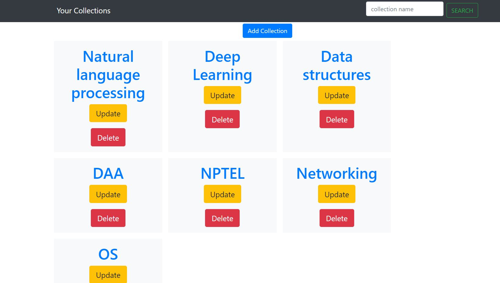

# collections

This project is a clone of the Microsoft Edge collections.

Each collection has multiple items. The items consist of:
1. Item name:
    - The name of the item in the collection
2. Item URL:
    - The URL of the item
3. Item image (optional):
    - The image of the item. This is an optional paramter.

The collections can be searched using the search bar on the top of the page. The collections can be searched based on the items name also. It returns the corresponding collection.

Bootstrap is used for the frontend.

# Screenshots

